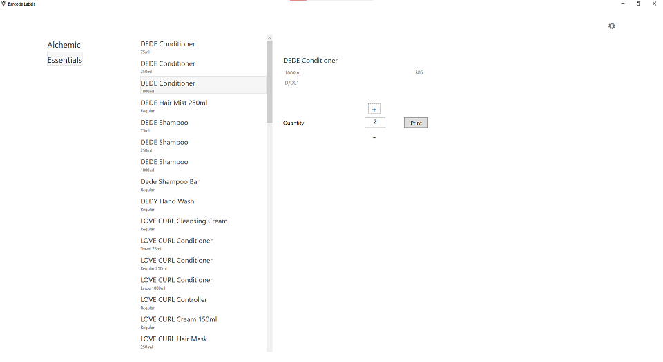
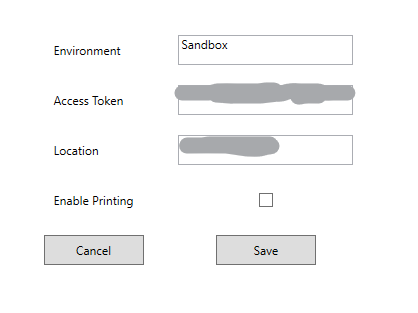

# SquareLabelPrinter

This application integrates with an existing Square account to assist in the management of inventory levels of products sold through Square. Users, upon receiving new inventory, may browse the current Square catalog to find a matching item. Selecting the matching item allows the user to print a barcode label (limited to Dymo label printers at this time) for each physical item. When an item is printed, the user is prompted to update the Square inventory level for the item. 3 labels printed results in 3 items added to Square's inventory.

Prior to this solution, the entry of inventory into Square was found to be problematic due to the multiple clicks where the information is entered. Previously, the process was: 

* Find the product
* Click on product
* Click on variations
* Click on specific variation
* Specify amount
* Click on reason
* Click ok to save
* Repeat for each product

That's a lot of _CLICKS_!!

# Setup

To setup the application, complete the following:

* Navigate to your [developer dashboard in Square](https://developer.squareup.com/apps)
* Add an application to your account
* After giving the application a name, record the application's:
  * Application ID
  * Access Token
  * Location, which is located along the left side as a separate line item
* Open the application
* Click on the gear icon to enter your Square information
   * Environment = Sandbox or Production
   * Access Token
   * Location
   * Click _Enable Printing_ if you have a Dynmo label printer and wish to print labels
   
   
* Once the settings are made, the catalog will be retrieved from Square to populate the UI

